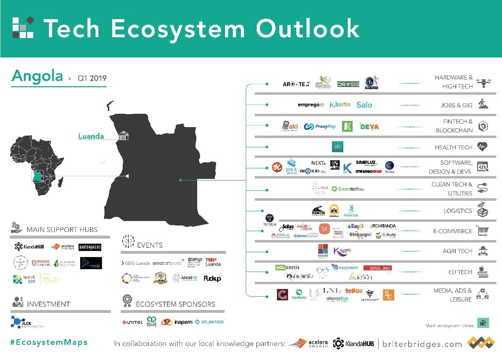

# startups-from-angola
> This is the list of all startups from Angola.

## Startups Sites
 > *Hardware and High Tech´s Startups*  

 >[Arotech](https://pt.arotech.org/).   

  > *Jobs & GIG* 

  >[Emprego](https://Emprego.com.ao).

  >[Jobartis](https://Jobartis.com).

  > *Fintech´s & Blockchain*

  >[Aki](https://Aki.com.ao).

  >[ProxyPay](https://Proxypay.com.ao).

  >[Deya](https://Deyamais.com).

  > *Softaware, Design e Devs*

  >[Pro IT](https://proit-consulting.co.ao).

  >[Inokri](https://Inokri.com).

  >[Simpluz](https://Simpluz.com).

  >[Mwango Brain](https://MwangoBrain.com).

> *Clean Tech & Utilities*

>[Green Tech](https://www.energygreentech.solutions).

> *Logistics*

>[Kubinga](https://www.Kubinga.tech).

> *E-commerce*
>[Tupuca](https://www.Tupuca.com).

>[Soba ](https://www.Soba-store.com).

>[Stekargo](https://www.Stekargo.com)

>[BayQI](https://www.Bayqi.com)

>[Otchitanda](https://www.Otchitnda.com)

> *AgriTech*.

>[Kitanda](https://www.Kitandaonlinemegastore.com).

>[Kepya](https://www.Kepya.co.ao).

> *ED Tech*.

>[Educartis](https://www.Educartis.co.ao).

>[Buka](https://www.Bukaapp.com)

>[Ecaderneta](https://www.ecaderneta.com)

>[Academia Nzoji](https://www.acadmianzoji.com)

>[Angola2Learn](https://www.Angola2learn.co.ao)

> *Media, Ads & leisure*.

>[Menos fios](https://www.menosfios.com).

    
 
